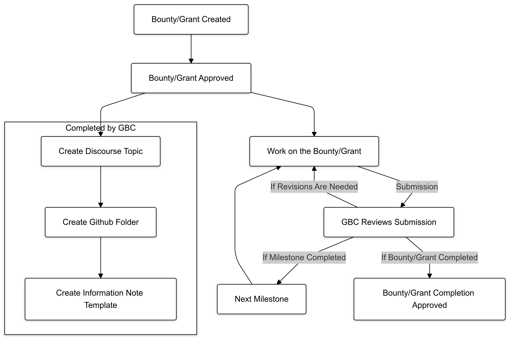

## Abstract

This AIP introduces the term "task," referring to parts of work completed under a time-commitment grant, distinct from bounties and grants, which are paid separately; as well as proposing a new, standardized process for all task, bounty and grant submissions within Arrow Air DAO to enhance transparency, organization, and accountability. The proposed process includes the mandatory use of an "Information Note" document, which will serve as a detailed and structured blueprint for each submission, outlining the project's objectives, deliverables, methodology, and results.

Additionally, the AIP introduces a structured folder system within the GitHub repository to systematically organize all submissions and associated deliverables according to their project and category, ensuring all documentation and outputs are easily accessible and well-maintained for future reference. This structured approach will improve the efficiency of locating, tracking, and reviewing past work, fostering a streamlined process for future iterations or improvements.

Furthermore, a Discourse forum will be integrated to provide a dedicated space for technical discussions and collaboration related to each bounty or grant. This forum will mirror the structure of the GitHub repository, allowing DAO members and contributors to engage in transparent, documented conversations and updates throughout the project’s lifecycle. 

## Motivation

The current process for bounty and grant submissions within Arrow Air DAO lacks a standardized approach, resulting in several issues:
- **Inconsistent Documentation**: Submissions often vary in format and completeness, leading to difficulties in evaluating and validating work. A standardized template will address this inconsistency.
- **Lack of Traceability**: Without a structured system, it is challenging to track the history of projects, including decisions made and changes implemented. This makes it difficult to understand past work and its implications for ongoing or future projects.
- **Inefficient Evaluations**: The GBC (Grants and Bounties Council) faces challenges when assessing submissions due to the absence of a unified documentation format. By standardizing this process, evaluations will become more efficient and consistent.
- **Fragmented Communication**: Technical discussions and progress updates are often scattered across different platforms without sufficient structure. This fragmentation reduces collaboration efficiency and increases the risk of miscommunication.
- **Knowledge Loss**: Without a cohesive system for documenting project outcomes and discussions, valuable insights and lessons learned are not consistently captured or transferred within the organization.
- **Disorganized Repositories**: The lack of a uniform structure in repositories leads to difficulties in locating and referencing project-related documents, increasing the time and effort required for accessing information.
- **Untracked Contributions**: Tasks completed within time-commitment grants often go undocumented when they are not associated with a bounty or grant. This results in a loss of valuable information, insights, and progress made during the study period.

By implementing this AIP, the DAO aims to resolve:

- **Organized Access and Record-Keeping:** This system ensures that all designs, deliverables, documents, and discussions are accessible in a structured manner. If a specific design or discussion is needed in the future, it can be easily located in its corresponding folder or forum.
- **Justification and Documentation:** The Information Note provides justification for the work performed. It documents the reasoning behind the chosen approach, potential limitations, and areas that may have been overlooked, assisting in refining requirements.
- **Clear Evaluation Process for GBC:** The structure aids the GBC in evaluating the completion of bounties. GBC members will have a clear, documented basis to assess whether the task has been completed according to the outlined specifications and deliverables.
- **Accountability and Traceability:** By logging all deliverables and decisions across GitHub and Discourse, the system ensures that individuals or teams responsible for the work are held accountable. All progress and outcomes will be transparently recorded, ensuring visibility for search engines.
- **Knowledge Transfer and Know-How Development:** Consistent documentation of bounties/grants facilitates the evolution of know-how. Anyone can access past Information Notes and forum discussions to learn about completed tasks, understand what was attempted, and identify areas for improvement. This will create a valuable knowledge base for future work.
- **Comprehensive Documentation for General Documents:** This system ensures that all work done within the DAO is thoroughly documented. These records can be utilized when generating overarching or general documents, ensuring that all relevant details and designs are consistently referenced and integrated.
- **Task Documentation Framework**: Introducing the tasks ensures that the studies conducted within time commitment grant are also documented properly.

## Specification
1. **Definition of Task**:
   - A "task" **SHALL** refer to a specific part of work completed under a time-commitment grant.
   - Tasks **MUST NOT** be independently funded or paid separately, as they are considered contributions completed within the broader scope of a time-based commitment.
   - It **SHALL** be at the discretion of the project team to determine whether a specific work package qualifies as a task.
   - The completion of a task **SHALL** be determined by the project team.

2. **Discourse Topic Integration**:  
   - For each approved bounty or grant, a corresponding Discourse topic **MUST** be set up, mirroring the GitHub folder hierarchy for consistency (see Specifications #3). This integration ensures that all technical discussions, progress updates, and collaborative efforts are easy-to-find and accessible. 
   - The GBC **MUST** create the aforementioned Discourse topic and provide the link to the bounty/grant worker.
   - Each topic **SHALL** use proper tags for the bounty or grant.
   - All communication related to the bounty or grant **SHOULD** be documented in the topic, providing a transparent and traceable record of the project’s progress and discussions.

3. **Structured Folder System**:  
   - Each task, bounty or grant **MUST** have a dedicated folder within the GitHub repository. An example for the current Project Feather Pod follows this hierarchical structure:  
     `Project (e.g., project-feather) / task-bounty-grant / Prototype Number (e.g., PT3) / Discipline (e.g., Avionics) / Title (landing-gear)`
   - The folder **MUST** be named with the format that follows: ID - Title of the Task/Bounty/Grant
     - ID count is shared between tasks, bounties and grants. It does not indicate if the work is completed through a task, a bounty or a grant.
     - ID count **MUST** be zero-padded to maintain a total length of 4 digits. (For example: `0001`, `0002`, `0003`)
     - ID count **MUST** start from `0001` for each new project.
   - For each bounty or grant, the GBC **MUST** create the aforementioned folder and provide the link to the bounty/grant worker.
   - For each task, the task completer **MUST** create the aforementioned folder.
   - The Information Note (see Specifications #4) **MUST** be located in the designated folder.
   - All deliverables **SHALL** be located in the designated folder.
     - All pictures **MUST** be placed in a folder named "picture", under the designated folder. This will help viewing other main deliverables easily.  
     - If uploading the deliverable to the designated folder is not possible or convenient, this **MUST** be stated in the "Results and Deliverables" section of the Information Note, also adding the location of the deliverable. 
   - This structure guarantees that every submission is organized in a consistent manner, making it easy for contributors and reviewers to access and evaluate the information.

4. **Information Note Requirement**:  
   - The Information Note will be used as the primary document for the GBC to review and validate the submission. Without a complete and thorough Information Note, including the referenced bounty or grant proposal, the submission **MUST** be marked as incomplete and returned to the applicant for revisions.
   - Each task, bounty and grant submission **MUST** include an "Information Note" document, providing a structured and comprehensive overview of the project.
   - For each bounty or grant, the GBC **MUST** create the aforementioned Information Note template for the bounty/grant and provide the link to the bounty/grant worker. The template **MUST** include the **Bounty or Grant Proposal Document** section.
   - For each task, the task completer **MUST** create the aforementioned folder.
   - After approval of completion by the GBC, the Information Note **SHALL NOT** be modified, excluding the status section.
   - In case the bounty/grant involves milestones, the Information Note **MUST** be updated for the approval of each milestone.
   - The Information Note **MUST** contain the following sections:
     - **Status Section:**  
       The Information Note will begin with a **Status Section** that indicates whether the work is valid, superseded, or if the current work is overwriting another. This provides immediate clarity on the document's relevance. Three main blanks are to be filled:
       - Validity: 
         - If the work is valid:  
         `Validity: Valid`
         - If the work is conditionally valid:  
         `Validity: Valid for XXX`
         - If the work is invalid:  
         `Validity: Invalid`
       - Revision History:
         - If the work has not been superseded:  
         `Revision History: None`
         - If the work has been superseded:  
         `Revision History: Superseded by Bounty or Grant #*****` (including a link to the repository of the superseding work)
       - Replacement Log:
         - If the work has not been overwritten:  
         `Replacement Log: None`
         - If the work has been overwritten:  
         `Replacement Log: Overwrites Bounty or Grant #*****` (including a link to the repository of the overwritten work)
       - Reference Log:
         - If the work does not have a reference work completed before through a task, bounty or grant but does not overwrite it:  
         `Reference: None`
         - If the work has a reference work completed before through a task, bounty or grant but does not overwrite it:  
         `Reference: Bounty or Grant #*****` (including a link to the repository of the reference work)
       - Milestone Log:
         - If the work has milestones:
         `Latest Milestone: #` 
     - **Project Description:** A detailed explanation of the project, including the title, objectives, and the problem it addresses.
     - **Bounty or Grant Proposal Document:** This section will be a direct copy of the bounty or grant proposal document. It serves as a reference to the original proposal, ensuring all related information is easily accessible within the Information Note.
     - **Methodology:** This section outlines the approach chosen to address the project’s objectives. It includes the theoretical framework and underlying principles that guide the work, ensuring the methodology is grounded in relevant science, engineering, or best practices. The strategy defines the steps and sequence of activities, considering key factors such as feasibility, efficiency, and compatibility with existing systems. Limitations and constraints are acknowledged to provide a realistic understanding of the project's scope and challenges. The section also highlights important considerations like material requirements, sustainability, and the expertise needed to successfully execute the project.
     - **Results and Deliverables:** This section provides a comprehensive overview of all outputs expected from the task, applicable across various domains such as design, development, analysis, and testing. It includes references to all deliverables stored in the submission folder, ensuring complete and organized documentation of the project. Deliverables may consist of CAD models, blueprints, or schematics for physical components; software features or modules developed for system integration; and test results validating the performance and reliability of the solution. It may also cover material selection reports, manufacturing guides with production steps, and simulation or analysis data demonstrating feasibility. Additionally, cost estimation, efficiency assessments, and rationale for key decisions offer transparency and justification for the chosen approaches. This section ensures that all engineering deliverables are clearly documented, consistent with the submission folder’s contents, and accessible for future reference.
     - **Remarks:** This section provides an assessment of the work completed and offers insights for future considerations. It includes an evaluation of the outcomes, highlighting successes and any areas where the work met or exceeded expectations. It also discusses potential risks encountered during the project and the risks associated with using or implementing the work, offering strategies for managing or mitigating these risks. Additionally, possible improvements and suggestions for refining the approach or outcomes are provided. Recommendations for future or follow-up work may be outlined, offering guidance for further developments, iterations, or related projects that build upon the current task. This section ensures a reflective, comprehensive, and forward-looking perspective on the work completed, promoting continuous improvement and innovation.

## Rationale

This AIP is designed to bring consistency, transparency, and accountability to the Arrow Air DAO’s bounty and grant submission process. By implementing a structured template and folder system, the DAO will ensure that all submissions are evaluated based on standardized criteria. The Discourse integration will centralize communications, allowing all technical discussions to be archived and accessed easily. Alternate methods, such as unstructured documents or using only GitHub issues, were considered but found inadequate for maintaining long-term clarity and traceability.

## Backwards Compatibility

This AIP introduces a new requirement for future submissions and does not affect existing standards. All previous submissions are unaffected; however, retroactive compliance **MAY** be recommended for consistency. This ensures that all ongoing and future projects align with the new structured approach, but no incompatibilities arise from this change.

## Test Cases

Test cases for this AIP will include simulated scenarios where the GBC reviews different variations of the Information Note template to verify completeness and effectiveness. These tests will ensure that the template captures all required information and that the folder structure and Discourse integration function as intended, supporting efficient review and traceability.

## Reference Implementation

Currently, although no complete reference implementation is provided as this AIP primarily focuses on standardizing documentation and processes, an example Information Note has been prepared based on a previous task, the testbed landing gear design, to illustrate the intended structure and content.
[Information Note](../assets/aip-5/0001-landing-gearinformation-note.md)

As this standard is adopted and used, more examples will accumulate, further enriching the repository of best practices and references.

## Security Considerations

This AIP does not introduce any new security vulnerabilities. However, it emphasizes the importance of maintaining the integrity of information stored and shared on the Discourse forum and GitHub repository. Proper permissions and access controls **MUST** be enforced to prevent unauthorized access and modification of documents, ensuring that the information remains secure throughout the submission and review process.
