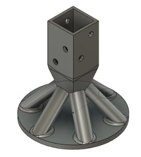

# Status  

`Valid`

`Revision History: None`

`Replacement Log: None`

`Reference: None`

# Project Description

This grant is issued for the need of a landing gear system on the testbed. The need emerged after some of the 3D printed motor mounts broke in two different hard landings, destroying the motors due to broken cables. The landing gear will protect the aircraft systems and airframe during landing, including hard landing cases.

# Grant Application Template
### Name of Grant
- What is the work being proposed?
    - Title of the project
    - Brief project description
- Why do you think this work is necessary?
- Is there any related work this builds upon?
- Will the results of this project be entirely open source? ([MIT], [GPL], [Apache], [CC BY] license or similar)?

### Benefits to Pod
- If this grant is successfully completed, how does it help the pod involved?

### Benefits to Arrow
- If this grant is successfully completed, how does it help Arrow?
- Which other non-Arrow DAOs, projects, or individuals, would stand to benefit from this grant?

### Assignee & Background
- Who is doing the work?
    - Name/Username
    - Email address
    - Organization (if applicable)
    - Website (if applicable)
- What is the background of the person(s) doing the work? What experience do they have with such projects in the past?
- Have you examples of similar work you have completed in the past?

### Work Details
- Do you need any input from another bounty/grant before the final submission?
- What is the breakdown of the proposed work, in terms of milestones and/or deadlines?
    - Please include specific dates for milestones.
    - Milestone 1
    - Milestone 2
    - Milestone 3
    - Milestone 4
- List the details of the problem and what you want to accomplish with this grant.
- What will be the outcomes of the grant? List all the deliverables and include specific dates for their delivery. For example;
    - CAD designs (Jan 4th)
    - analysis results (Jan 12th)
    - manufacturing guide (Jan 20th)
    - necessary documentation (Jan 27th)
- In which areas can this work be used? What is the scope of its applicability?
- What metrics will be used to evaluate the outcomes of the project? E.g. how the GBC would measure the impact of your project.

### Risk Assessment
- What are the potential risks or challenges for this project?
- How will these risks be managed or mitigated?
- How will you handle unforeseen obstacles or delays?
- Is there a long-term plan for updating or improving the work over time?
- What steps can be taken to ensure the longevity and sustainability of the work?

### Costs
- How many work hours will be spent on this grant?
- How much USDC/ARROW is the applicant requesting?
- How does the amount requested represent good value for Arrow?
- What is the proposed payment schedule for the grant?
- How will the GBC verify that the work delivered matches the proposed cadence?
- What alternatives or options have been considered in order to save costs for the proposed project?
- Have you examples of similar work you have completed in the past?

# Methodology 
The main considerations for the design are:

- Ease of manufacturing, specifically through 3D printing
- Durability for repeated use
- Protection of aircraft components by absorbing the energy from landing impacts
- Compatibility with the existing landing legs, avoiding the need to replace them or develop additional systems.

The optimal design for a basic landing gear involves creating it as a single component, where the gear itself functions as the shock absorber. The material must be compatible with most 3D printers on the market and possess a degree of flexibility to ensure it effectively absorbs impact energy. The design should achieve an ideal balance of stiffness to compress under the testbed’s landing loads at maximum takeoff weight (MTOW), while remaining structurally sound when supporting the MTOW on the ground. 

The strength of 3D-printed parts is influenced by various factors, such as the type of printer, slicing software, print settings, and the condition of the filament, which makes FEA unreliable and misleading in this case. In addition, performing a dedicated structural test would require specialized equipment and a complex test setup, making it both expensive and time-consuming. As a result, the model will be tested directly on the aircraft, with iterative adjustments made based on its performance during real-world use.

# Results and Deliverables

TPU (Thermoplastic Polyurethane) was chosen as the primary material due to its excellent elastic properties and durability. Unlike more rigid materials like PLA, TPU provides flexibility that helps absorb impact energy, making it ideal for applications involving shock absorption such as landing gear.

TPU's elasticity ensures that the landing gear can deform under load and then return to its original shape, minimizing the risk of structural damage and enhancing the longevity of the components during repeated use.

The CAD design is created using Fusion 360. It consists of 6 angular tubes that are acting as shock absorbers, a bottom plate to prevent the tubes to be bent more than intended, and a tube on top that will wrap the testbed landing legs. The landing gear is installed on the landing leg using four M5 bolts. Each bolt needs to be longer than 55 mm, with a thread coverage of at least 25 mm. The nuts should be locknuts to ensure they remain secure and do not loosen due to vibration.

The model is printed on a Bambu Lab X1-Carbon Combo 3D printer. One landing gear is used per landing leg, making 4 in total. The design is used for multiple flight tests, and no damage on the landing gear is observed. During the flight tests, the landing gear proved to be successful for absorbing the landing loads.

The landing gear design: https://a360.co/4dwC8Na

# Remarks
- The decision to use TPU for the landing gear was crucial to enhancing its shock absorption and resilience. The material’s flexibility provides a distinct advantage over rigid options like PLA or ABS, especially in applications where energy absorption is key to preventing damage.
- While the single body landing gear system worked effectively in this case, further refinements in the design may help maximize its energy-absorbing potential and strength, such as incorporating different materials for the installation area or thickness variations that enhance deformation in critical areas during impact.
- Initial testing has shown promising results, but additional real-world testing is recommended to assess the long-term performance of TPU under varying environmental conditions and repeated landings.
